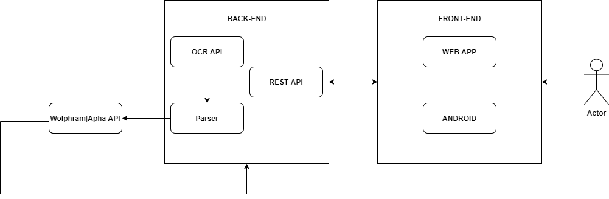

# SciQ

Our project aim to develop an application that allow the recognition and further the resolution of symbolic mathematical formulas.
The insertion of the formulas could happen through the use of a predefined text-area or through the uploading of an image containing a formula.
The resolution of the formulas happen through the use of Wolphram|Alpha's API.

## Web App
The web application is reachable at : [SciQ](https://sciq-unimib.herokuapp.com/)

## High-level architecture

### REST API handle:
    * Sign-in
    * Sign-up
    * User's expression history
    
### OCR API handle:
    * Delivering of the image getted from the user to the OCR model
    * Return the output of the model as ASCIIMath
    
### PARSER handle:
    * Convert from ASCIIMath string to LateX
    

