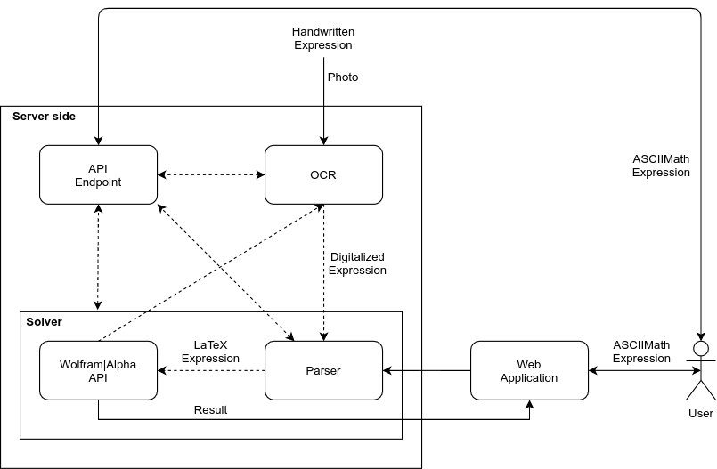

# SciQ

Our project aim to develop an application that allow the recognition and further the resolution of symbolic mathematical formulas.
The insertion of the formulas could happen through the use of a predefined text-area or through the uploading of an image containing a formula.
The resolution of the formulas happens through the usege of Wolphram|Alpha's API.

## High-level pipeline

<div align="center">
  
</div>

Our pipeline is developed with a Dev-Ops centered methodology, in which we make sure that our application has passed routine and building tests before being used from the community.  
Our application is also available as an Android APK and can be installed in everyone smartphone.

## High-level architecture

As one can see from the image below, our architecture is simple but effective and can be useful in multiple ways: from the simple conversion of an ASCIIMath expression into its LaTeX representation to the resolution of arbitrary symbolic mathematical expression, sent from a web form or directly uploading an image.

<div align="center">
  
</div>

With our platform one can also save expressions into collections, make them available publicy and share them with collegues or in a community.

## APIs

### RESTful APIs:

* Sign-in
* Sign-up
* User's expression history
* Creation of per-user AppID for unlimited API usage
    
### OCR APIs:

* Delivering of the image from the user to the OCR model
* Return the output of the model as ASCIIMath
    
### PARSER APIs:

* Convert expressions from ASCIIMath to LateX

### Exposed APIs:

In order to use the APIs without limitations one has to create an AppID (after login, go to https://sciq-unimib.herokuapp.com/developer) and send it with the request. If one sends the AppID then it has up to 200-per-hour/800-per-day requests, otherwise 50-per-hour/200-per-day.
The exposed APIs are:

* **/api/v1/parser**
  
  ```python
  curl -X GET \
    -H "Content-type: application/json" \
    -H "Accept: application/json" \
    -d '{"expression":"x_2^3+logx", "appid": "your_appid"}' \
    "http://0.0.0.0:5000/api/v1/parser"
  ```
  **Parameters**:

  * expression: expression to be translated from ASCIIMath to LaTeX
  * appid (optional): the user AppID
  

  As a result one gets `{"latex": "x_{2}^{3} + \\log x"}`

* **/api/v1/solver**
  ```python
  curl -X GET \
    -H "Content-type: application/json" \
    -H "Accept: application/json" \
    -d '{"expression":"x_2^3+logx=0","output": "plaintext","result": "default"}' \  
    "http://0.0.0.0:5000/api/v1/solver"
  ```
  **Parameters**:

  * expression: ASCIIMath expression to be solved
  * output (optional): mathml or plaintext
  * result (optional): full or default
  * appid (optional): the user AppID
  
  As a result one gets
  ```python
    {
        "Input": [
            "x(2)^3 + log(x) = 0"
        ], 
        "Solution": [
            "x = e^(-x(2)^3)"
        ], 
        "alternate_forms": [], 
        "execution_time": 0.854, 
        "integral": [], 
        "limits": [], 
        "partial_derivatives": [], 
        "query": "\\left( x_{2}^{3} + \\log x = 0\right)", 
        "results": [], 
        "solutions": [], 
        "success": true, 
        "symbolic_solutions": []
    }
  ```
  

One can also call an API and pass parameters as query parameters (**query parameters must be correctly encoded**):
  ```python
  curl -X GET \
    -H "Accept: application/json" \
    "http://0.0.0.0:5000/api/v1/parser?expression=x_2%5E3+%2B+logx&appid=your_appid"
  ```

An **error** will be returned if the expression parameter is missing: `{"error": "no expression to parse"}`.  
A **429 error** will be returned if one reaches the limit request.  
Those curl requests have been tested on Ubuntu 20.04 (for Windows users: get Linux!)
    


